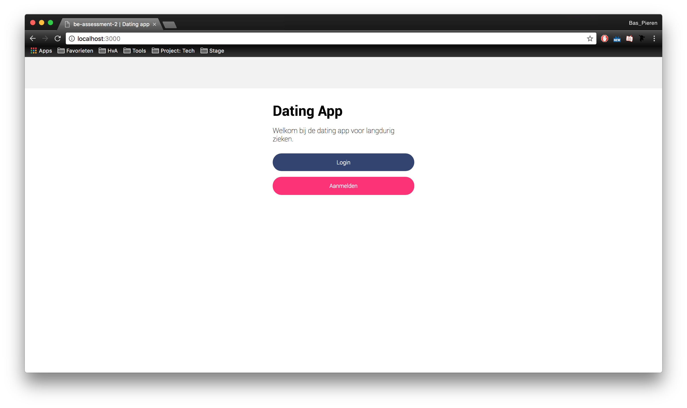
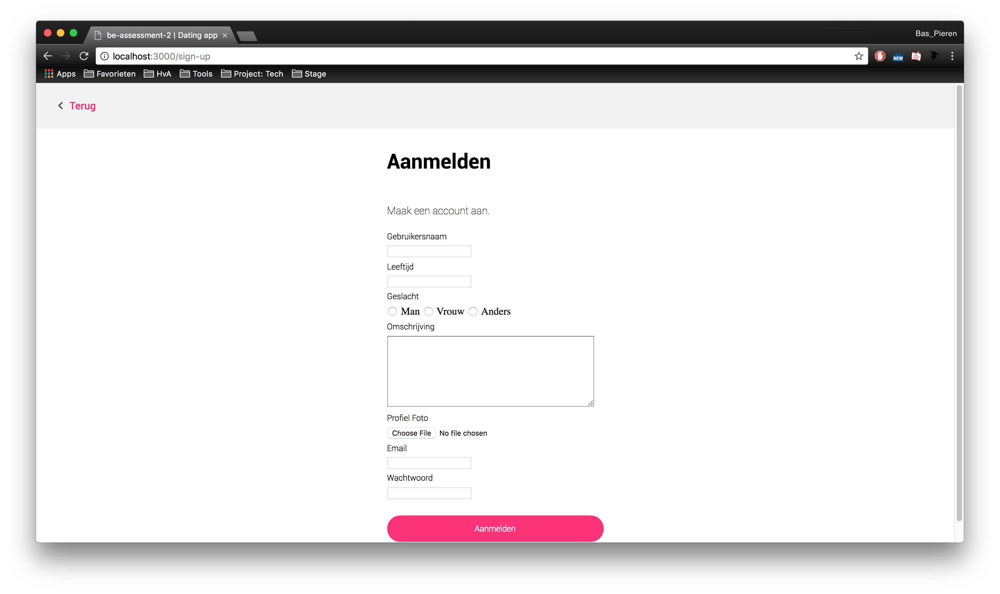
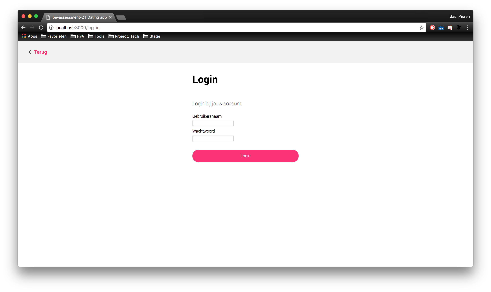
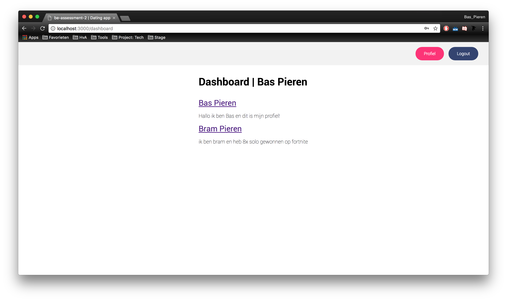
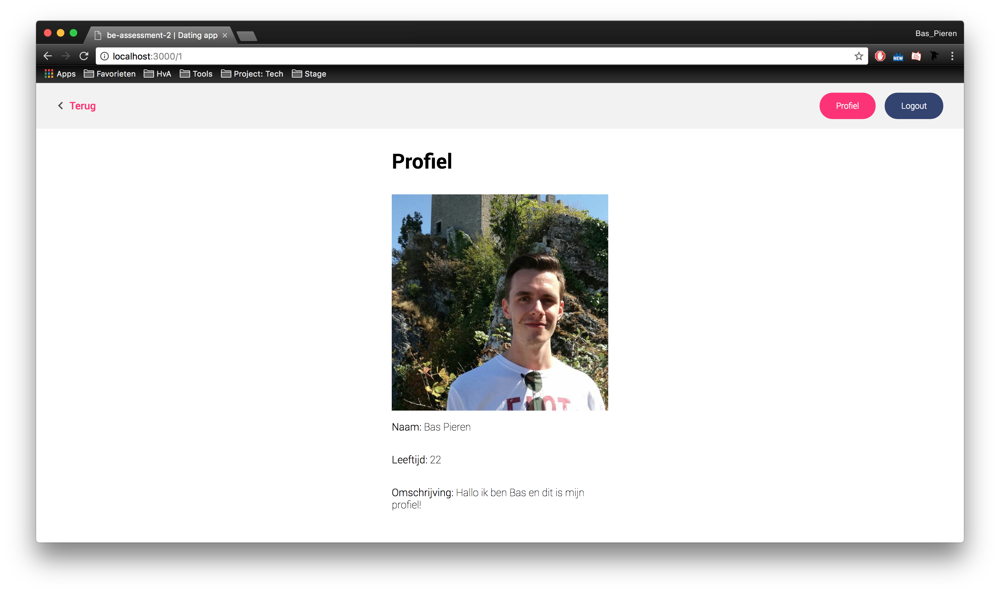

# be-assessment-2 | Dating App
This is the repo for my assessment 2 project where I made a dynamic website using Git, Node.js, Express, SQL and MySQL. This website is a dating app where users who are ill for a long period of time can find people who are in a similar situation.


> Dating app starting page

## Table of Contents
* [To Do](#to-do)
* [Description](#description)
* [Installing](#installing)
* [Sources](#sources)
* [Licence](#licence)

## To Do
This is a list of things in want to do in this project.
- [x] Create an account
- [x] Login / Logout
- [x] View profile(s)
- [ ] Edit own profile information
- [ ] Find matches
- [ ] Send a chat message

## Description
This website is a dating app where users who are ill for a long period of time can find people who are in a similar situation.

### Start
The starting page is the first screen users will see. Here they have the choice to create an account or login to an existing one.


> Dating app starting page

### Sign up
Add the sign up page users can create their own account. They need to fill in the following information:

* Name
* Age
* Gender
* Description
* Profile Picture
* Email
* Password

This information is used during the matching process between different user. All the information is also saved into a local MySQL database.


> Dating app sign up page

### Login
Add the login screen users can login with there own username and password that they created during the sign up process.


> Dating app login page

### Dashboard
At the dashboard users will find all their potential matches based on their information. They can also navigate to their own profile and logout.


> Dating app dashboard page

### Profile
At the profile page users can see their own profile information. They also have the ability to alter their own information.


> Dating app profile page

## Installing
To install this application enter the following into your _terminal_:
```
git clone https://github.com/BasPieren/be-assessment-2.git

cd be-assessment-2

npm install
```

Then to start the server enter the following:  
```
node server
// or
nodemon server
```

### Database
After installing you will also have to create a MYSQL database as a place to store all data. I choose to use MySQL as a database because this is the first time worked with dynamic content and MySQL is the database that was used as example during lectures.

After you installed MySQL you have to login to your account:
```
mysql -u your-username -p
```

Then run the following SQL to create the database and enter it:
```
CREATE DATABASE IF NOT EXISTS mydatingapp;

USE mydatingapp
```

After creating the database run the following SQL to create the users table. This is the place where we will store all users that register a account:
```
CREATE TABLE IF NOT EXISTS users (
  id INT NOT NULL AUTO_INCREMENT,
  username TEXT CHARACTER SET utf8,
  age TEXT CHARACTER SET utf8,
  gender TEXT CHARACTER SET utf8,
  description TEXT CHARACTER SET utf8,
  picture TEXT CHARACTER SET utf8,
  email TEXT CHARACTER SET utf8,
  hash TEXT CHARACTER SET utf8,
  PRIMARY KEY (id)
);
```

### Packages and technologies
This project makes use of the following packages and technologies:

* [argon2](https://www.npmjs.com/package/argon2)
* [body-parser](https://www.npmjs.com/package/body-parser-json)
* [dotenv](https://www.npmjs.com/package/dotenv)
* [ejs](https://www.npmjs.com/package/ejs)
* [express](https://www.npmjs.com/package/express)
* [express-session](https://www.npmjs.com/package/express-sessions)
* [nodemon](https://www.npmjs.com/package/nodemon)
* [mysql](https://www.npmjs.com/package/mysql)
* [multer](https://www.npmjs.com/package/multer)

All of these where recommended and used as examples by [Titus Wormer](https://github.com/wooorm) during the lectures and labs so thats why I also made use of them.

## Sources
This project makes use of the following sources provided by [Titus Wormer](https://github.com/wooorm):
* [plain-server](https://github.com/cmda-be/course-17-18/tree/master/examples/plain-server)
* [express-server](https://github.com/cmda-be/course-17-18/tree/master/examples/express-server)
* [mysql-server](https://github.com/cmda-be/course-17-18/tree/master/examples/mysql-server)
* [Backend Development Lecture 6](https://docs.google.com/presentation/d/1BHMqO9UV5ePt29n8cnjaznvye8Gu_HrdzhzC3h5rgOI/edit#slide=id.g2922825c54_2_58)
* [Backend Development Lab 8](https://docs.google.com/presentation/d/17acFykwNaTmiiPZJElAqBfz-9XlvuRf6KNU2t-Bm5w0/edit#slide=id.g2922825c54_2_58)

## Licence

MIT © [Bas Pieren](https://github.com/BasPieren)
